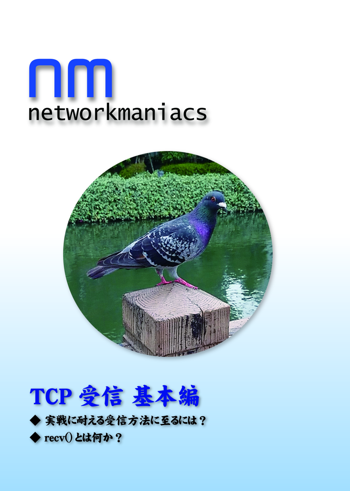
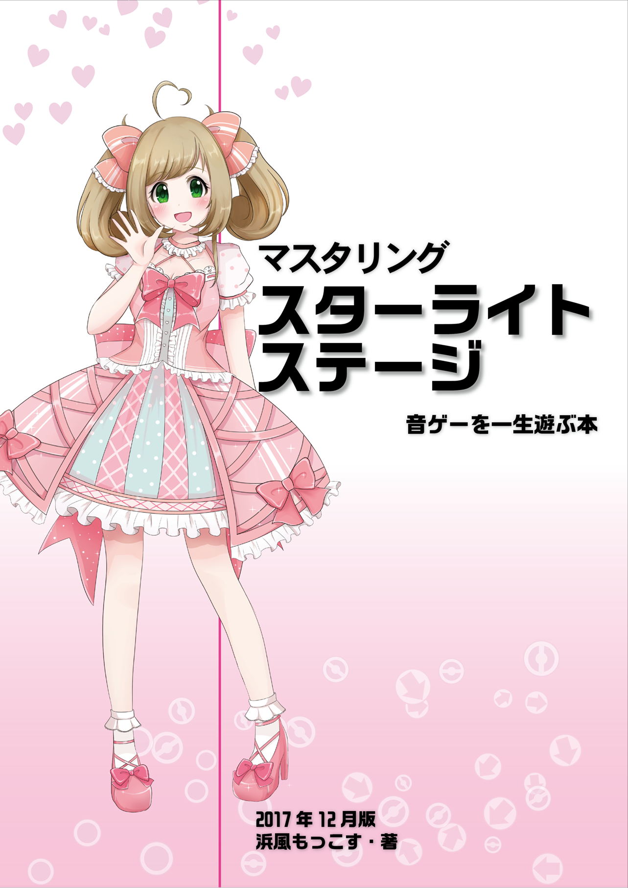

コミックマーケット94 活動情報
====
**1日目 8/10(金) [西 む41b](https://webcatalog-free.circle.ms/Map#13921853/day=Day1/hall=w12/scale=1) 浜風もっこす**
にて、技術系同人誌を頒布予定です。

## Network Maniacs TCP受信 基本編 [新刊]

TCPの受信を理解し、そして正確にアプリケーションで扱うための知識に特化した本です。
10年越えベテランでも平然とエンバグする、本当は怖いTCP受信。これに立ち向かうための、理論とサンプルコードの解説が含まれます。

## マスタリング スターライトステージ [既刊]
技術書ではありませんが、真面目に攻略した本ですので、プロデューサー諸氏にはぜひご覧になっていただきたく。

デレステの音楽ゲーム部分の攻略本ですが、譜面の解説本ではありません。
音ゲー歴まもなく20年を迎えるのに飽きずに遊んでいる筆者による、音ゲーを楽しむための知識を詰め込んだ本です。
パターン攻略を中心に、タッチパネル知識・メンタルコントロールまで。

* [サークル情報](./)
