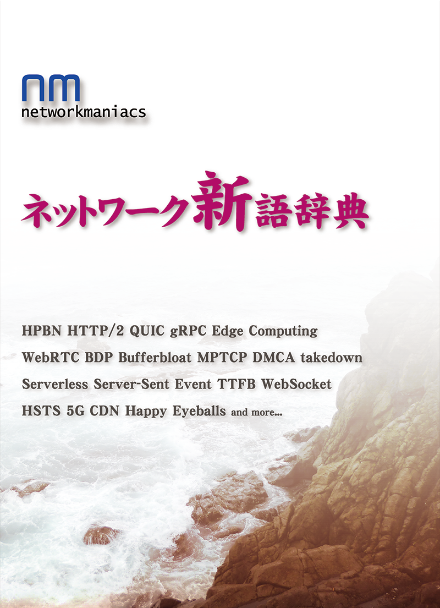
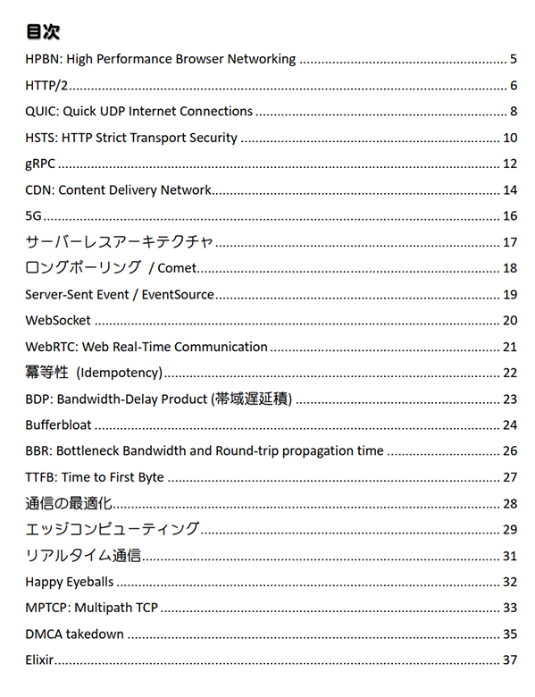
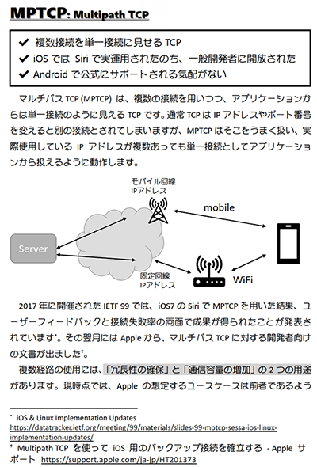

Network Maniacs ネットワーク新語辞典
====

### 頒布情報

* 7/27(土) [技術書同人誌博覧会（技書博）](https://gishohaku.dev/)にて頒布予定です。
* 8/12(祝) コミックマーケット96 (夏コミ) 4日目 月曜日 でも頒布予定です。
* 冊子版を [とらのあな さんに若干数委託中](https://ec.toranoana.shop/tora/ec/item/040030769470)です。
* 電子版は準備中です。

### 書籍情報
A5 40p、表紙カラー・本文モノクロです。

## サンプルページ
クリックで拡大します。

* [サークル情報](../)
