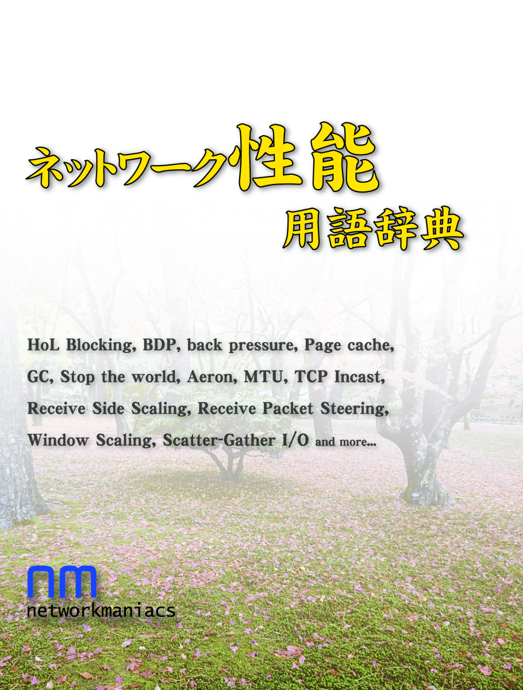
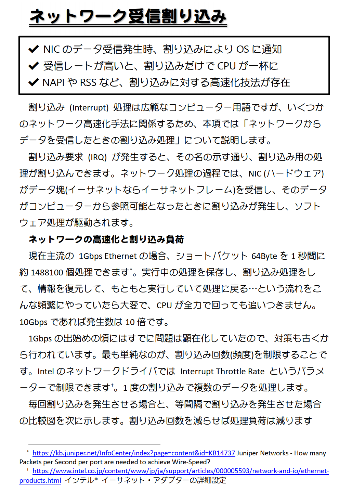

Network Maniacs ネットワーク性能用語辞典
====

### 頒布情報

* 2019/09 [技術書典7](https://techbookfest.org/event/tbf07) か27C にて頒布予定です。
* 冊子版は とらのあな さんに若干数委託予定です。
* 電子版は準備中です。

### 書籍情報
A5 36p、表紙カラー・本文モノクロです。

ネットワークアプリケーションの実装や、サーバーサイドの運用時に役立ちそうな性能用語を選定しました。
1項目2ページ以内で解説します。

## サンプルページ
クリックで拡大します。

## 本文中URLのリンク集
* GC
  * [ガベージコレクションのアルゴリズムと実装 - 達人出版会](https://tatsu-zine.com/books/gcbook)
* ゼロコピー通信
  * [PACS-CSのための Ethernetを用いた高性能通信機構の設計 (論文 PDF)](https://www.rccp.tsukuba.ac.jp/PACS-CS/file/report2.pdf)
  * [netmap](https://github.com/luigirizzo/netmap)
  * [DPDK](https://www.dpdk.org/)
  * [NetDev2.1 sendmsg copy avoidance with MSG_ZEROCOPY (論文 PDF)](https://www.netdevconf.org/2.1/papers/debruijn-msgzerocopy-talk.pdf)
  * [MSG_ZEROCOPY が UDPに実装されたcommit](https://github.com/torvalds/linux/commit/b5947e5d1e710c35ea281247bd27e6975250285c)
* ネットワーク受信割り込み
  * [Juniper Networks - How many Packets per Second per port are needed to achieve Wire-Speed?](https://kb.juniper.net/InfoCenter/index?page=content&id=KB14737)
  * [インテル® イーサネット・アダプターの詳細設定](https://www.intel.co.jp/content/www/jp/ja/support/articles/000005593/network-and-io/ethernet-products.html)
* RSS
  * [［Windows 7編］ネットワーク設定を標準で使ってはいけない - 日経 xTECH（クロステック）](https://tech.nikkeibp.co.jp/it/article/COLUMN/20100824/351391/)
  * [予期せぬ挙動が!?　新機能 Scalable Networking Pack をご存知ですか? – Ask the Network & AD Support Team](https://blogs.technet.microsoft.com/jpntsblog/2010/03/22/scalable-networking-pack/)
  * [VM のネットワーク スループットの最適化 - Microsoft Docs](https://docs.microsoft.com/ja-jp/azure/virtual-network/virtual-network-optimize-network-bandwidth)
* RPS
  * [Linux Network Scaling: Receiving Packets](https://garycplin.blogspot.com/2017/06/linux-network-scaling-receives-packets.html)
  * RedHat Customer Portal のネットワーク解説
    * [英語版](https://access.redhat.com/documentation/en-us/red_hat_enterprise_linux/6/html/performance_tuning_guide/s-network-packet-reception)
    * [日本語版](https://access.redhat.com/documentation/ja-jp/red_hat_enterprise_linux/6/html/performance_tuning_guide/s-network-packet-reception)
  * [Linuxカーネルの networking/scaling.txt](https://www.kernel.org/doc/html/latest/networking/scaling.html)
  * [How to achieve low latency with 10Gbps Ethernet - Cloudflare Blog](https://blog.cloudflare.com/how-to-achieve-low-latency/)
* Aeron
  * [https://github.com/real-logic/aeron](https://github.com/real-logic/aeron)
  * [https://lmax-exchange.github.io/disruptor/](https://lmax-exchange.github.io/disruptor/)
  * [AeronのDesign Principle](https://github.com/real-logic/aeron/wiki/Design-Principles)
* グラフデータベース
  * [ArangoDB ってのが面白いと思うんだ - 偏見プログラマの語り！](http://pg-kura.hatenablog.com/entry/2018/04/22/203951)
  * [グラフデータベースNeo4Jでアセットダウンロードの構成管理と最適化 - CEDEC Digital Library](https://cedil.cesa.or.jp/cedil_sessions/view/1635)
* ページキャッシュ
  * [Heap: Sizing and Swapping - Elasticsearch](https://www.elastic.co/guide/en/elasticsearch/guide/current/heap-sizing.html)
* メッセージキューサービス
  * [Q: Amazon SQS と Amazon Kinesis Streams の違いは何ですか?](https://aws.amazon.com/jp/sqs/faqs/)
* TCP Window Scaling
  * [QUICの論文 (PDF)](https://dl.acm.org/citation.cfm?id=3098822.3098842)
  * [TCP Receive Window Auto-Tuning Level feature in Windows](https://support.microsoft.com/en-gb/help/4494445/tcp-receive-auto-tuning-level-feature-in-windows)
  * [Azure VMのチューニング文書](https://docs.microsoft.com/ja-jp/azure/virtual-network/virtual-network-tcpip-performance-tuning)
* MTU
  * [【図解】MTUとMSS, パケット分割の考え方（IPフラグメンテーションとTCPセグメンテーション）](https://milestone-of-se.nesuke.com/nw-basic/grasp-nw/mtu-mss-fragment-segment/)
  * [ＪＰＲＳ トピックス＆コラム ■ 「５１２の壁」を越える ～ＥＤＮＳ０の概要と運用上の注意～ (PDF)](https://jprs.jp/related-info/guide/008.pdf)
  * [インターネットプロトコルにおけるパケットサイズに関して:Geekなぺーじ](https://www.geekpage.jp/blog/?id=2019-5-24-1)
  * [QUICの論文 (PDF)](https://dl.acm.org/citation.cfm?id=3098822.3098842)
* バックプレッシャー
  * [バックプレッシャーとは - IT用語辞典 e-Words](http://e-words.jp/w/バックプレッシャー.htm)
  * [通信のBack pressureを「背圧」とする誤訳をやめよう - 賞味期限切れぷろぐらまー](http://moccosblue.blogspot.com/2015/05/translatebackpressure.html)
* Scatter-Gather I/O
  * [Scatter/Gather I/O - Windows applications - Microsoft Docs](https://docs.microsoft.com/ja-jp/windows/win32/winsock/scatter-gather-i-o-2)
  * [Ubuntu Manpage: sendmmsg - 複数のメッセージをソケットへ送信する](http://manpages.ubuntu.com/manpages/bionic/ja/man2/sendmmsg.2.html)

* [サークル情報](../)
