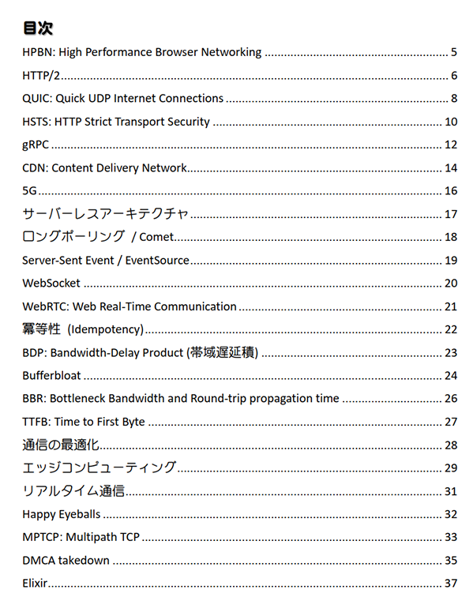

Network Maniacs ネットワーク性能用語辞典
====

### 頒布情報

* 2019/09 [技術書典7](https://techbookfest.org/event/tbf07) か27C にて頒布予定です。
* 冊子版は とらのあな さんに若干数委託予定です。
* 電子版は準備中です。

### 書籍情報
A5 36p、表紙カラー・本文モノクロです。

## サンプルページ
クリックで拡大します。

* [サークル情報](../)
