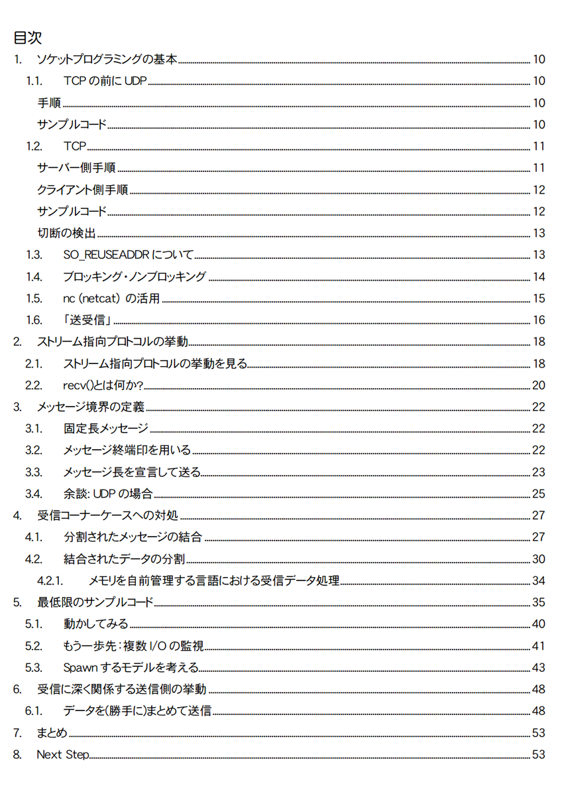
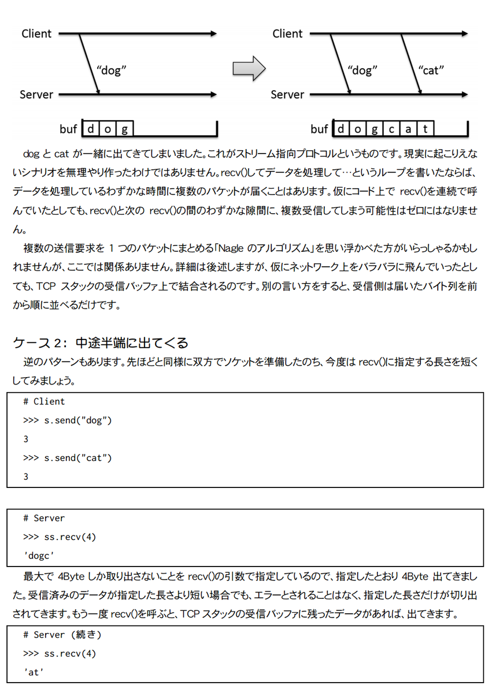
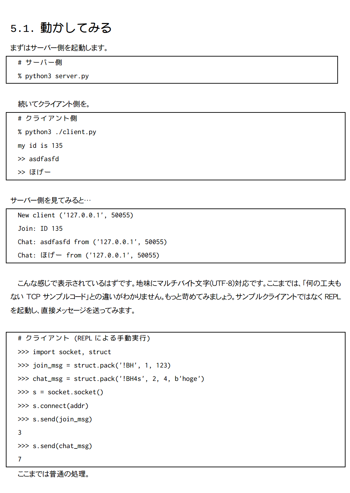
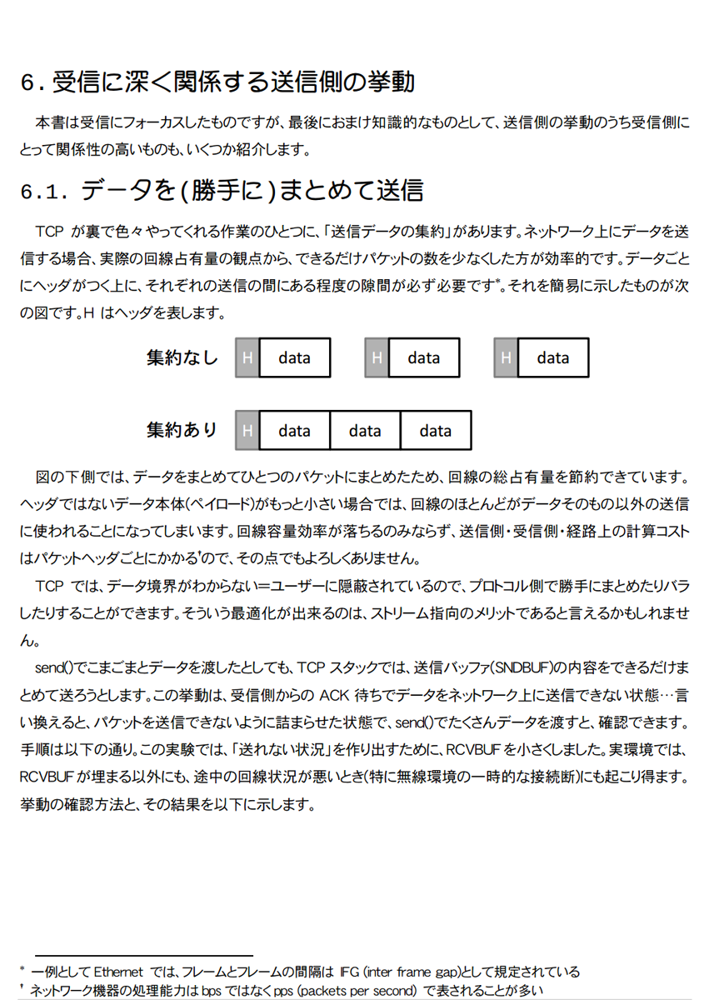

Network Maniacs TCP受信 基本編
====

### 頒布情報

* [COMIC ZINさんで委託中](https://shop.comiczin.jp/products/detail.php?product_id=37189)です。
* 技術書典5 にて頒布予定です。
* コミックマーケット94 1日目 8/10(金) [西 む41b](https://webcatalog-free.circle.ms/Map#13921853/day=Day1/hall=w12/scale=1)
浜風もっこす にて頒布しました。

### 書籍情報
B5 60p、表紙カラー・本文モノクロです。

TCPの受信を理解し、そして正確にアプリケーションで扱うための知識に特化した本です。
10年越えベテランでも平然とエンバグする、本当は怖いTCP受信。これに立ち向かうための、理論とサンプルコードの解説が含まれます。

サンプルコードリポジトリは [GitHubのmoccos/nwm_tcp_recv_basic_sample](https://github.com/moccos/nwm_tcp_recv_basic_sample)
にあります。

## サンプルページ
クリックで拡大します。

* [コミックマーケット94 出展情報](../c94.html)
* [サークル情報](../)
