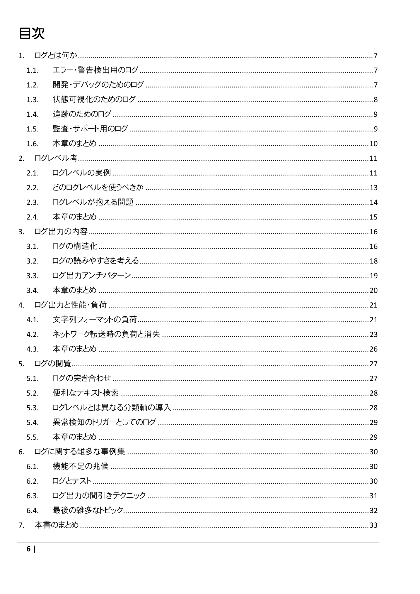
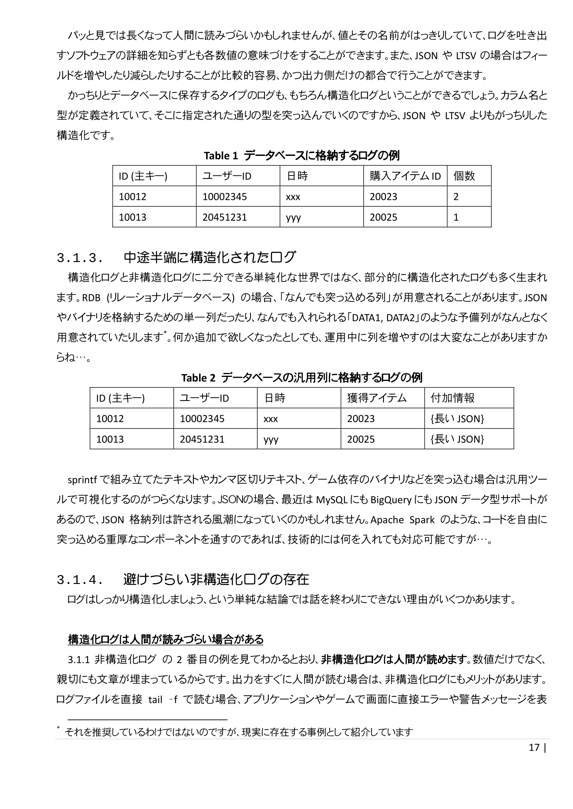
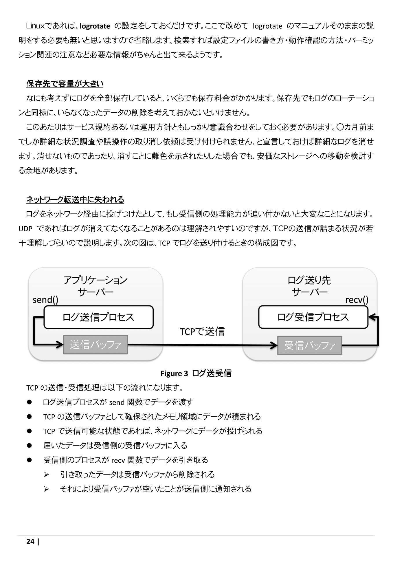

実用的なログの探求
====

### 頒布情報

* 2022/09 技術書典13
* [技術書典マーケット](https://techbookfest.org/product/bHY1TZaNdF28NKgAfFzmG2?productVariantID=a5ZjVctAPkQNDvsR91JYbU)にて電子版頒布中です

### 書籍情報
B5 36p、表紙カラー・本文モノクロです。

エラーログ・デバッグログなど、ないがしろにされがちなログの取り扱いに関する事例・考察をまとめた本です。

## サンプルページ
クリックで拡大します。

* [サークル情報](../)
