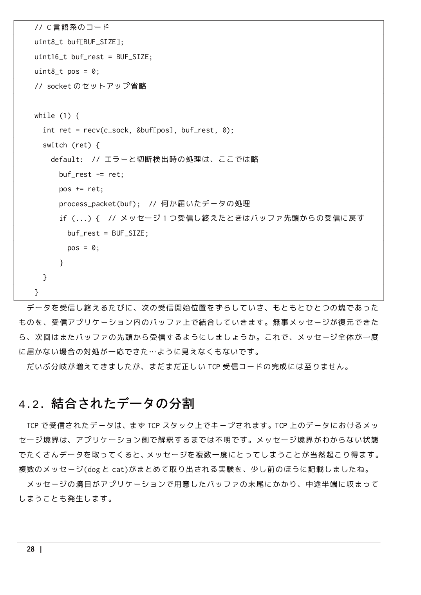

技術書典4 新刊「Network Maniacs TCP受信編」
====
[き-09 浜風もっこす](https://techbookfest.org/event/tbf04/circle/17400001)にて頒布予定。
B5 56p、表紙カラー・本文モノクロです。

TCPの受信を理解し、そして正確にアプリケーションで扱うための知識に特化した本です。
10年越えベテランも平然とエンバグする、本当は怖いTCP受信。これに立ち向かうための、理論とサンプルコードの解説が含まれます。

以下のサンプルは、クリックで画像ファイルに飛びますので、文字も読めます。

その他
====
いわゆる技術書ではないなのですが、C93などで頒布した音ゲーの攻略本「[マスタリング スターライトステージ](./c93.html)」も若干数持ち込みます。
音ゲーの技術本と言える可能性も…。

* [サークル情報](./)
